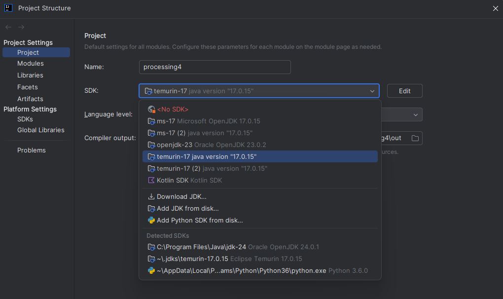
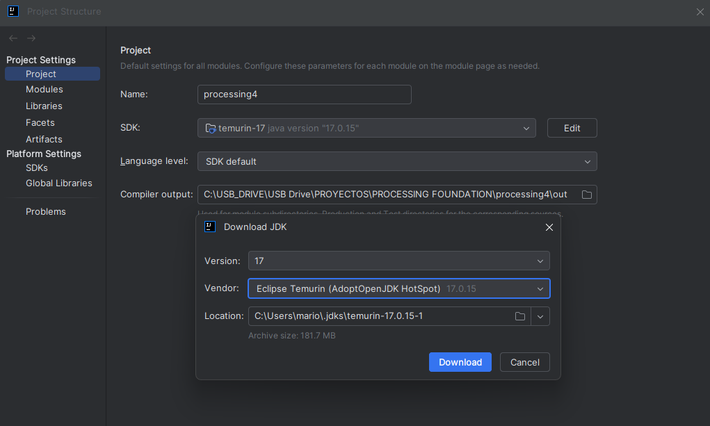

# How to Build Processing

Great to see you are interested in contributing to Processing. To get started you will need to have an IDE to build and develop Processing. Our recommendation and what we use ourselves is Intellij IDEA.

## IntelliJ IDEA

First, [download the IntelliJ IDEA Community Edition](https://www.jetbrains.com/idea/download/). Make sure to select the "Community Edition", not "Ultimate". The Community Edition is free and built on open-source software. You may need to scroll down to find the download link. Then:

1. Clone the Processing4 repository to your machine locally
1. Open the cloned repository in IntelliJ IDEA CE
1. When prompted, select **Trust Project**. You can preview the project in Safe Mode but you won't be able to build Processing.
1. IntelliJ may start loading Gradle dependencies automatically. Wait for this process to complete.
1. In the main menu, go to File > Project Structure > Project Settings > Project.
1. In the SDK Dropdown option, select a JDK version 17 or Download the jdk
1. Click the green Run Icon in the top right of the window. This is also where you can find the option to debug Processing. 
1. Logs can be found in the `Build` or `Debug` pane on the bottom left of the window

## VSCode
1. Clone the Processing4 repository to your machine locally
1. Open the cloned repository in VScode
1. Wait for Gradle to set up the repository
1. (If you want debugging install [Debugger for Java](https://marketplace.visualstudio.com/items?itemName=vscjava.vscode-java-debug) and [Java Extension Pack](https://marketplace.visualstudio.com/items?itemName=vscjava.vscode-java-pack)) 
1. Go to the Gradle Tab and click app -> Tasks -> compose desktop -> run

Instructions for other editors are welcome and feel free to contribute the documentation for those [here](#other-editors)

## Architecture
Processing consists of three main components: `Core`, `Java`, and `App`. The `Core` is independent, while `Java` and `App` depend on it. Currently, `Java` and `App` are interdependent, but efforts are underway to decouple them.

- **Core**: The essential code included with your sketches that provides Processing’s basic functions. When you use functions like `ellipse(25,25,50,50)` or `background(255)`, their underlying code is part of `Core`.

- **Java**: The part of Processing that compiles and runs `.pde` files. It supports different *modes* which implement support for different languages or versions of Processing. The default mode is `Java`.

- **App**: This is the Processing Development Environment (PDE), the visual part of the editor that you see and work within when you use Processing.

### Examples

- You want to fix a bug with one of the argument of a function that you use in a sketch. The `Core` is probably where you would find the implementation of the function that you would like to modify.
- A bug of the PDE editor has been keeping you up at night, you would likely find the relevant code in the `App` section of this project.
- If you've written a large sketch and Processing has become slow to compile and run it, a place to improve this code can most likely be found in the `Java` section.

## User interface
Historically, Processing's UI has been written in Java Swing and Flatlaf (and some html & css). Since 2025 we have switched to include Jetpack Compose, mostly for it's backwards-compatibility with Swing. This approach allows us to gradually replace Java Swing components with Jetpack Compose ones, instead of doing a complete overhaul of the editor.

## Build system

We use `Gradle` as the build system for Processing. Until 2025, Processing used `Ant` but we have switched to `Gradle` to be more in line with modern standards. We plan to migrate the internal build system of the `Java` mode to `Gradle` as well, unifying both systems for simplicity.

## Kotlin vs Java
With the introduction of the Gradle build system we now support Kotlin within the repository. Refactors from Java to Kotlin are not  necessary at this stage, but all new functionality should be written in Kotlin.

Any classes that end up being written in Kotlin have their equivalent Java class under `app/ant/` source directory. 

### Running Processing

The main task to run or debug the PDE is `run`. That means you just need to run `./gradlew run` (Linux) or `./gradlew.bat run` (Windows) to build and run Processing.

If your main concern is with the `Core` you don't need to build and start the whole PDE to test your changes. In IntelliJ IDEA you can select any of the sketches in `core/examples/src/.../` to run by click on the green arrow next to their main functions. This will just compile core and the example sketch. Feel free to create additional examples for your new functionality.

## Other editors

TBD

## Troubleshooting and Setup Tips (IntelliJ IDEA)

If you’re building Processing using IntelliJ IDEA and something’s not working, here are a few things that might help:

### Use the Correct JDK (temurin-17)

Make sure IntelliJ is using **temurin-17**, not another version. Some users have reported issues with ms-17.

1. Go to **File > Project Structure > Project**
2. Set the **Project SDK** to:    `temurin-17 java version "17.0.15"`

If it is not already installed, you can download it by:
1. Clicking the SDK input field and then selecting the `Download JDK...` option from the menu
2. Select Version: `17`, Vendor: `Eclipse Temurin (AdoptOpenJDK HotSpot)`

Now go back to your main window and
1. Click the green Run Icon in the top right of the window.

### “Duplicate content roots detected”

You may see this warning in IntelliJ:

> `Duplicate content roots detected: '.../processing4/java/src'`

This happens because multiple modules reference the same source folder. It’s safe to ignore.

